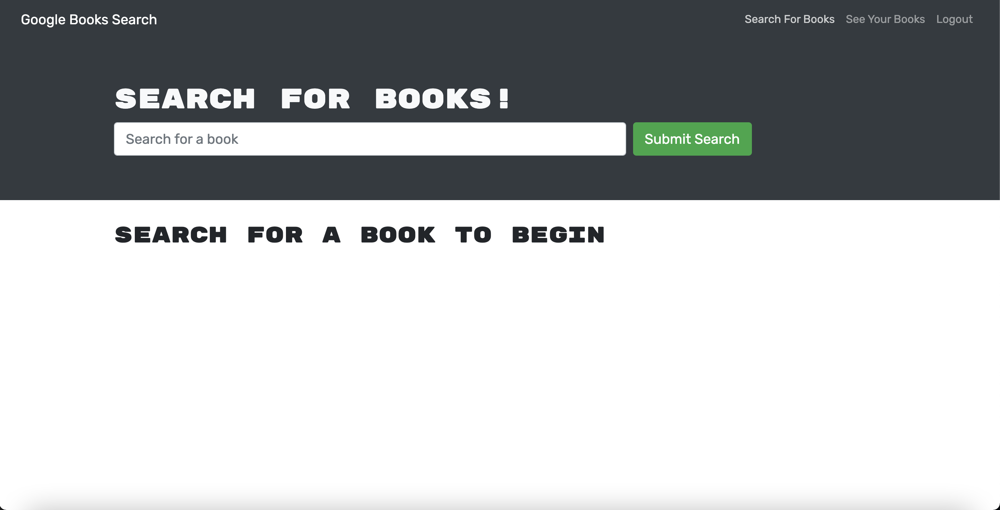
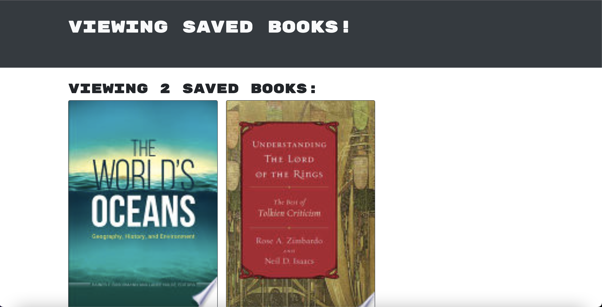

# MERN-Book-Search

## Description 

This application is a book search using the MERN stack. The other technology that is used in this application is GraphQL and the Google Books API. With this application you can create an account to search for the books. You can search for the books then you can save the books if you would like to. After you have read the saved books or changed your mind, you can also delete the books!

All the saving, searching and erasing of the books go with the Apollo client. To use the application all you have to do is click [here](https://week21-mern-book-search-new.herokuapp.com/).

## Table of Contents

* [Installation](#installation)
* [Usage](#usage)
* [License](#license)
* [Credit](#credit)

## Installation

There is no need to install anything for this app. All you have to do is click on the link [here](https://week21-mern-book-search-new.herokuapp.com/)!!

## Usage 

When yu would like to use this application just visit the links above!

1. You just have to sign up for an account. To do that you have to click the login/sign up button at the top of the screen. 

2. When you are signed in you can search for different books in the search bar. 

3. When you have chosen a book that you would like to save, you just have to click on the 'Save this book' button under the description of the book. 

4. You can continue to look for books or add more books. 

5. When you want to see the different books that you have saved, you can click on the middle button at the top of the screen.

6. When you are taken to the saved book page, where you can continue to look or you could delete them by hitting the 'Delete Book' button under the description.

## License 

MIT License

## Credits 

* UCONN Coding Bootcamp
